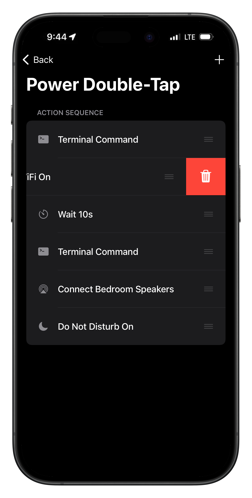

# RemoteCompanion

RemoteCompanion provides fast, scriptable system control for modern rootless jailbreaks. It lets you bind physical gestures and hardware buttons, or send commands remotely from your computer, to trigger system actions, control media playback, and run custom scripts.

> [!IMPORTANT]
> **What's New in v2.2**
> - **Run as Root**: Full support for system-level actions via a native root toggle in the editor and CLI flags (`rc -r`).
> - **Lua Dynamic Bridge**: Lua scripts now support `dlopen` and `objc_call`.
> - **New System Utilities**: Native support for `ldrestart`, `userspace-reboot`, and `uicache`, built directly into the core and available as preset UI actions.
> - **Trigger Favorites**: Mark any trigger as a favorite for instant access at the top of the picker for instant access to edit or long-press to run.
> - **Device Status Queries**: Poll device state from the CLI. Includes DND, Low Power Mode, WiFi, Bluetooth, **Player Status** (`rc player status`), and **Live Debug Logs** (`rc logs`).
> - **System Vibration Control**: New `rc vibration` command to **Turn On/Off** or Toggle the system-wide "Vibrate on Silent" and "Vibrate on Ring" settings directly from the CLI or Action Picker.
> - **Bottom Bar Gestures**: New swipe triggers for the bottom edge of the screen (left/right).

<p align="center">
  
  
  
  
</p>

## Features
- **Instant Response**: High-speed command execution (~0.25s) using optimized TCP probes on port `12340`.
- **Smart Control**: Run multi-step action sequences, edit existing actions inline, or control settings remotely.
- **Hardware Triggers**: Bind actions to Power/Volume buttons, Home button, Touch ID (Tap/Hold), or the Ringer Switch.
- **Visual Excellence**: Modern iOS aesthetics with Large Titles, SF Symbols, and a professional dark terminal editor.
- **Universal Search**: Instantly find actions, shortcuts, and devices with integrated search bars in every picker.
- **Cross-Version Support**: Full compatibility for iOS 14 through iOS 16+, supporting both Rootless and Rootful environments.
- **Advanced Automation**: Full support for NFC tags, custom Lua scripts, and native Siri integration.
- **iPad Experience**: Native landscape orientation and optimized layouts for iPad power users.
- **Live Discovery**: Discovery-based live lists for nearby AirPlay and Bluetooth hardware.
- **True Multitasking**: Concurrent server handling powered by GCD—zero battery drain, zero blocking.

## What you can do

### Media & Volume
- `rc play` / `rc pause` / `rc playpause` / `rc next` / `rc prev`
- `rc volume 0-100` - Set volume level.
- `rc mute [on|off|toggle|status]` - Control media mute state.
- `rc anc [on|off|transparency]` - Control headphone ANC (requires Sonitus).

### Device Control
- `rc lock` / `rc lock toggle`
- `rc unlock <pin>` - Wakes and unlocks the device.
- `rc button [power|lock|home|volup|voldown|mute]` - Simulate physical buttons.
- `rc brightness 0-100` - Set screen brightness.
- `rc flashlight [on|off|toggle]` - Control the torch.
- `rc rotate [lock|unlock|toggle]` - Orientation lock control.
- `rc dnd [on|off|toggle]` - Toggle Do Not Disturb.
- `rc low power mode [on|off|toggle]` - Toggle battery saver.
- `rc airplane [on|off|toggle]` - Control Airplane Mode.
- `rc haptic` / `rc screenshot` - Haptic feedback / Screenshot (or activate Snapper 3).
- `rc vibration [silent-toggle|ring-toggle]` - System "Vibrate on Silent/Ring" settings.

### Apps & Shortcuts
- `rc open <alias|bundleID>` (e.g., `youtube`, `spotify`, `settings`, `messages`, `home`, `photos`, `camera`, `clock`, `maps`, `calendar`, `weather`, `notes`, `reminders`, `appstore`, `mail`, `music`, `phone`, `stocks`, `calculator`, `tv`, `wallet`, `facetime`, `files`).
- `rc kill <alias|bundleID>` - Force close an app.
- `rc shortcut -r "Name" [-p "Input"]` - Run any Shortcut (requires SpringCuts).
- `rc url "https://google.com"` - Open any link (with smart unlock).
- `rc spotify <playlist|album|artist> <id>` - Play specific Spotify content.
- `rc spotify play` - Resume Spotify playback.

### Connectivity
- `rc wifi [on|off|toggle]` / `rc bluetooth [on|off|toggle]`
- `rc bluetooth [connect|disconnect] <name>` - Manage paired devices.
- `rc airplay list` - See speakers and their UIDs.
- `rc airplay connect <UID|Name>` / `rc airplay disconnect`

### Hardware Triggers (Tweak App)
Configure these in the `RemoteCompanion` app for custom action sequences. Tip: **Long-press** any trigger in the app to instantly test and run its assigned actions.
- **Hardware Buttons**:
  - **Power**: Double-tap, Long-press, **Triple/Quadruple click**, or **Power + Volume Up/Down** combos.
  - **Volume**: Long hold Up/Down (0.3s) or **Volume Up + Down** combo.
  - **Home**: Double-tap (Touch ID), Double, Triple, or Quadruple click.
- **Touch ID Sensor**: **Single Tap** and **Hold (Rest Finger)** triggers.
- **NFC Triggers**: Scan physical NFC tags to run actions on screen wake (Optional toggle in Settings).
- **Ringer Switch**: Mute, Unmute, or Toggle triggers.
- **Gestures**: 
  - **Status Bar**: Hold (Left/Center/Right) or Swipe Left/Right.
  - **Edge Gestures**: Vertical swipe on left/right edges.

### Text & Notifications
- `rc type "Text"` - Type text (supports symbols).
- `rc paste "Text"` - Paste into clipboard.
- `rc key <hex>` - Specific keyboard keys (e.g., `0x04` for 'A', `0x28` for Enter).
- `rc log` - View the RemoteCompanion server logs.

### Status & Queries
Get instant feedback from your device state.
- `rc volume` - Returns current volume %.
- `rc app` - Returns foreground app bundle ID.
- `rc is-locked` / `rc lock status` - Returns `locked` or `unlocked`.
- `rc player status` - Returns detailed playback state (`Playing`, `Paused`, `Stopped`, etc.).
- `rc mute status` - Returns current media mute state and level.
- `rc logs` - Stream live debug logs from the device (tail `/tmp/remotecommand.log`).
- `rc vibration [silent-status|ring-status]` - Check current system vibration state (CLI only).
- `rc rotate status` - Returns orientation lock state.
- `rc dnd status` - Returns Do Not Disturb state.
- `rc lpm status` - Returns Low Power Mode state.
- `rc airplane status` - Returns Airplane Mode state.
- `rc wifi status` / `rc bt status` - Returns connectivity states.
- `rc flashlight status` - Returns torch state.

### System & Diagnostics
- `rc respring` - Restart SpringBoard.
- `rc ldrestart` - Soft reboot the device.
- `rc userspace-reboot` - Reboot userspace.
- `rc uicache` - Refresh the icon cache.

<details>
<summary><h3>Lua Scripting & Objective-C Bridge</h3></summary>

RemoteCompanion v2.2 introduces a powerful Lua bridge that allows you to execute arbitrary Lua scripts within the tweak's process. exact same context is available whether you run a script file from the CLI or paste code into the "Lua Script" action in the app.

### How to Run
- **From CLI**: `rc lua /path/to/script.lua`
- **From UI**: Add Action → System → **Custom Lua Script**. Paste your code directly into the prompt.

### API Bindings

| Function | Description |
| :--- | :--- |
| `log(msg)` | Writes to the system log (syslog). |
| `delay(seconds)` | Pauses execution for `seconds`. |
| `haptic()` | Triggers a standard haptic feedback. |
| `openURL(url)` | Opens a URL scheme (e.g. `prefs:root=General`). |
| `dlopen(path)` | Loads a dynamic library. Returns `true` on success. |
| `objc_call(target, selector, args...)` | Calls an Objective-C method. `target` can be a class name string or an instance. |

### Examples

**Trigger Haptic and Log**
```lua
log("Starting haptic engine...")
haptic()
delay(0.2)
haptic()
log("Finished haptic feedback.")
```

**Call a Class Method (get a shared instance)**
```lua
-- objc_call(className, selector) returns an instance
local device = objc_call("UIDevice", "currentDevice")
if device then
    objc_call(device, "setBatteryMonitoringEnabled:", true)
    local level = objc_call(device, "batteryLevel")
    log("Battery: " .. tostring(level * 100) .. "%")
end
```

**Load a Private Framework or Dylib**
```lua
-- Load your dylib first, then call methods on it
local ok = dlopen("/path/to/yourlibrary.dylib")
if ok then
    -- Use a shared accessor if the class provides one
    local instance = objc_call("YourClass", "sharedInstance")
    if instance then
        objc_call(instance, "yourMethod")
    else
        -- Or allocate a new instance
        local obj = objc_call(objc_call("YourClass", "alloc"), "init")
        objc_call(obj, "yourMethod")
    end
end
```

> [!NOTE]
> `objc_call` works like standard Objective-C messaging — it does not scan memory for existing instances. To call an instance method, you first need to obtain the instance via a class-level accessor (e.g. `sharedInstance`, `currentDevice`) or by allocating a new one with `alloc`/`init`.

</details>

## Getting Started

### 1. Requirements
- A **Jailbroken Device** (iOS 14+). Supports both Rootless (iOS 15+) and Rootful (iOS 14) environments.
- The `RemoteCompanion` tweak installed.

### 2. Installation Options

#### Option 1: Repository (Recommended)
Add `https://saihgupr.github.io/remotecompanion` to Sileo or Zebra

[Add to Zebra](zbra://sources/add/https://saihgupr.github.io/remotecompanion)

[Add to Sileo](sileo://source/https://saihgupr.github.io/remotecompanion)

#### Option 2: Manual Install
Download the `.deb` from [Releases](https://github.com/saihgupr/remotecompanion/releases).

#### Option 3: Build from Source
`cd Tweak && make package install`.

### 3. Usage Options
Choose the control method that best fits your needs:

#### Option 1: TCP Server (Fastest)
Control your iPhone from your computer terminal using the `rc` script.

> [!NOTE]
> This method is **faster** than SSH because it avoids the encryption handshake overhead. Recommended for low-latency triggers. **Requires "TCP Server" enabled in app settings.**

1. Copy the script to your path:
   ```bash
   chmod +x rc
   sudo cp rc /usr/local/bin/rc
   ```
2. Set your iPhone's IP (add this to your `~/.zshrc`):
   ```bash
   export RC_IPHONE_IP=192.168.1.10
   ```
3. Run the command:
   ```bash
   rc play
   ```

#### Option 2: SSH Direct (Secure)
Control the device directly via SSH using the `rc` command installed on the iPhone.
This method works even if the external "TCP Server" is disabled in settings.

```bash
ssh mobile@iphone.local "rc lock"
ssh mobile@iphone.local "rc volume 50"
ssh mobile@iphone.local "rc respring"
```

#### Option 3: Shortcuts (External Triggers)
Control your device using iOS Shortcuts. There are two primary ways:

**A. Using Native SSH (Localhost)**
The most reliable method without extra tweaks. Requires **OpenSSH**.
1. Add the **Run script over SSH** action.
2. Configure host settings:
   - **Host**: `localhost`
   - **Port**: `22`
   - **User**: `mobile` (or `root`)
   - **Password**: Your SSH password (default is `alpine`)
3. Enter your command:
   ```bash
   rc flashlight toggle
   rc dnd on
   ```

**B. Using Powercuts (Shell)**
If you have **Powercuts** installed, you can run `rc` commands directly via shell.
1. Add the **Run shell command** action.
2. Enter your command:
   ```bash
   rc open Music
   rc volume 50
   ```
   
<details>
<summary><h3>Home Assistant Setup</h3></summary>

Add this to your `configuration.yaml`:
```yaml
shell_command:
  iphone_remote: >
    bash -c 'echo '\''{{ cmd }}'\'' > /dev/tcp/YOUR_IPHONE_IP/12340'
```
Then call it with:

```yaml
service: shell_command.iphone_remote
data:
  cmd: 'play'
```

</details>

## Security

RemoteCompanion implements several measures to ensure your device remains secure:

### Security
RemoteCompanion's External TCP Server (ports 12340-12344) is designed for speed and convenience within a trusted local network.

- **Enablement**: The server must be explicitly enabled in the app settings under "TCP Server".
- **Local Network**: It is recommended to use the TCP server only on trusted home networks.
- **SSH Support**: For secure remote access over the internet, we recommend using SSH (which is enabled by default on jailbroken devices). The `rc` script will automatically fallback to SSH if the direction connection is unavailable.

### Root Access Control
The "Root Command" feature must be explicitly enabled in the app settings.

## Troubleshooting

### Apple Pay Issues
If you experience the "Updating Cards" screen or other conflicts with Apple Pay when waking your device, you can disable the background NFC scanning feature.
1. Go to the **Settings** tab (gear icon).
2. Toggle off **NFC Scanning**.

This ensures the tweak does not attempt to access the NFC controller on wake, resolving conflicts with system services.

### iOS 14 arm64e (A12+) Compatibility
Due to Pointer Authentication Code (PAC) changes in modern toolchains, iOS 14 on **arm64e (A12 and newer)** devices is currently unsupported and may cause a Safe Mode loop.
- **Supported**: iOS 14 on A11 and below (iPhone 8/X and older, iPad Air 2, etc.)
- **Supported**: iOS 15+ on all devices.
- **Workaround**: If you are on iOS 14 with a newer device, you may need to compile the tweak using **Xcode 15.4** or earlier to ensure correct PAC signatures.


## Support & Feedback

If you encounter any issues or have feature requests, please [open an issue](https://github.com/saihgupr/remotecompanion/issues) on GitHub.

RemoteCompanion is open-source and free. If you find it useful, consider giving it a star ⭐ or making a [donation](https://ko-fi.com/saihgupr) to support development.